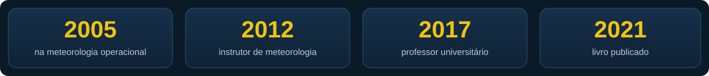
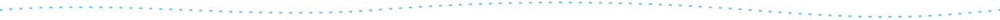

<div align="center">





<br>

<a href="https://meteorologia-hiremar-aviacao.streamlit.app"></a>
<a href="http://lattes.cnpq.br/4090433887712772"></a>




</div>

```text
METAR PERFIL 011900Z 00000KT CAVOK 20/12 Q1013 NOSIG=
```
<sub>Brincadeira de meteorologista: céu claro, visibilidade ilimitada e ótimas condições para aprender. 🌤️</sub>

## 👋 Sobre mim

Meteorologista com atuação na aviação civil e militar, com experiência técnica e acadêmica desde **2005**.
Mestre e Bacharel em Meteorologia pela **USP (IAG)**, sou professor universitário desde 2017 e
instrutor de Meteorologia Aeronáutica na LATAM Airlines Brasil. Minha docência é voltada à formação de
pilotos, DOVs e comissários, com ênfase em conteúdo operacional, segurança de voo e ensino digital.


## 🛰️ O que estou construindo

| Projeto | Para quê |
|---|---|
| [**Site de briefing e aulas**](https://meteorologia-hiremar-aviacao.streamlit.app) | Autobriefing com satélite GOES-19, SIGMET, METAR/TAF e modelo GFS, além de aulas em vídeo e simuladores interativos |
| [**meteorologia-hiremar**](https://github.com/hiremar/meteorologia-hiremar) | Código do site e dos robôs que coletam METAR/SPECI da REDEMET e organizam as planilhas mensais de consistência |
| [**Simulado-SIPAER**](https://github.com/hiremar/Simulado-SIPAER) | Simulado de Segurança de Voo e Prevenção de Acidentes Aeronáuticos |

## 📚 Publicação

SILVA, H. A. J. S.; CABRAL, E. *Meteorologia Aplicada à Aviação: PP, PC, PLA, DOV e Comissário de Voo – Avião e Helicóptero.* São Paulo: Espaço Aéreo, 2021.

## 🧰 Ferramentas

<p>


</p>

Dados: API REDEMET (DECEA) · NOAA GOES-19 · NOAA GFS

## 🎯 Áreas de atuação

`Meteorologia aeronáutica` `Meteorologia operacional` `Segurança de voo e AVSEC` `Formação de aviadores` `Ensino digital`


<sub>Perfil pessoal, de apoio ao ensino. O conteúdo não representa posição oficial de nenhuma instituição e não substitui as fontes oficiais de informação meteorológica e aeronáutica.</sub>
